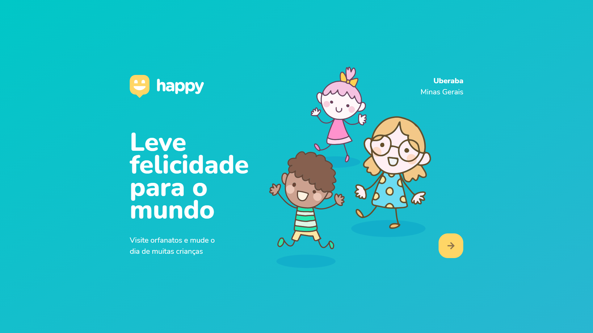

<p align="center">
    
</p>

<p align="center">
  <a href="#-projeto">Projeto</a>&nbsp;&nbsp;&nbsp;|&nbsp;&nbsp;&nbsp;
  <a href="#-ferramentas">Ferramentas</a>&nbsp;&nbsp;&nbsp;|&nbsp;&nbsp;&nbsp;
  <a href="#-tecnologias">Tecnologias</a>&nbsp;&nbsp;&nbsp;|&nbsp;&nbsp;&nbsp;
  <a href="#-rodando">Rodando a Aplicação</a>&nbsp;&nbsp;&nbsp;|&nbsp;&nbsp;&nbsp;
  <a href="#-layout">Layout</a>&nbsp;&nbsp;&nbsp;|&nbsp;&nbsp;&nbsp;
  <a href="#-licença">Licença</a>
</p>

<br/>

<p align="center">
    
</p>

<br/>

## 💻 PROJETO

<p align="justify">
    O Happy é uma aplicação que conecta pessoas à casas de acolhimento institucional para fazer o dia de muitas crianças mais feliz. É possível cadastrar essas instituições e visualizar informações sobre elas, como horário de visitas, fotos, localização...
</p>

<br/><br/>

## 🛠 FERRAMENTAS

Durante o desenvolvimento deste projeto foi utilizado os seguintes softwares:

- Ambiente de programação: [VSCode](https://code.visualstudio.com/)
- Navegador WEB: [Chrome](https://www.google.com/intl/pt-BR/chrome/) ou [Edge](https://www.microsoft.com/pt-br/edge)


<br/><br/>

## 🚀 TECNOLOGIAS

Esse projeto foi desenvolvido com as seguintes tecnologias:

- HTML
- CSS
- Javascript
- [Node.js](https://nodejs.org/en/)
- [Express](https://expressjs.com/pt-br/)
- [SQLite](https://www.sqlite.org/index.html)
- [Handlebars](https://handlebarsjs.com/)

<br/><br/>

## 🧭 RODANDO A APLICAÇÃO

```bash

# Clone este repositório
$ git clone https://github.com/f1989/happy

# Acesse a pasta do projeto no seu vscode
$ cd happy

# Instale as dependências
$ npm install

# Execute a aplicação 
$ npm start

# O servidor inciará na porta 5500 - acesse http://localhost:5500 ou http://127.0.0.1:5500/
```

<br/><br/>

## 🔖 LAYOUT

Você pode visualizar o layout do projeto através [desse link](https://www.figma.com/file/mDEbnoojksG4w8sOxmudh3/Happy-Web). É necessário ter uma conta no [Figma](http://figma.com/) para acessá-lo.

<br/><br/>

## 📝 LICENÇA

Esse projeto está sob a licença MIT. Veja o arquivo [LICENSE](LICENSE.md) para mais detalhes.

<br/>

---

<p align="justify">
    Feito por Fernando Oliveira Lopes durante a Terceira Edição da NLW (Next Level Week) da Rocketseat.
</p>

Visite: 
<br/>
[Rocketseat](https://rocketseat.com.br/)
<br/>
[NLW - Next Level Week](https://nextlevelweek.com/)